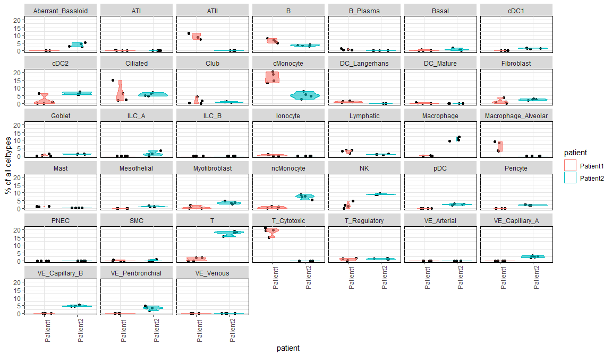

Deconvolution of PCLS bulk RNASeq using IPF Atlas scRNAseq using Bisque
================

### Overview of Bisque Analysis:

Bisque is a tool designed to deconvolute bulk RNAseq data into cell
proportions based on available single cell RNAseq data(1). For reference
based decomposition, BisqueRNA need an input of the bulkRNA seq read
counts and the scRNASeq read counts in the form of ExpressionSet.

> 1.Jew, Brandon, et al. “Accurate estimation of cell composition in
> bulk expression through robust integration of single-cell
> information.” Nature Communications 11.1 (2020): 1-11.

BisqueRNA package:

<https://cran.r-project.org/web/packages/bisque/index.html>

## Part 1: Preparation of PCLS bulk RNA-seq Data for Bisque input.

### Part 1a. Background information, PCLS RNAseq:

**Library Preparation:** TruSeq Stranded mRNA Library Prep Kit
(Illumina) was used with an input of 150 ng RNA (determined by the Qubit
RNA HS Kit), following the manufacture’s instruction with the exception
that 13 cycles instead of 15 was used to enrich DNA fragments. The IDT
for Illumina TruSeq RNA UD Indexes (96 indexes) was used to index the
different samples for multiplexing. A King Fisher FLEX (Thermo
Scientific) was used for automatisation of the clean-up steps and a
Mastercycler X50s (Eppendorf) was used for the incubations and PCR. The
QuantIT dsDNA HS Assay Kit (Invitrogen) was used to determine the DNA
concentration of the library.

**Library Quality Control:** The size and quality of the library was
tested using the LabChip GX Touch (Perkin Elmer) with the DNA 1K / 12K /
Hi Sensitivity Assay LabChip (Perkin Elmer) and the LabChip DNA High
Sensitivity Reagent Kit.

**Sequencing:** A library input of 1.4 pM (with 1 % PhiX Control
(Illumina)) was sequenced using the NextSeq 500 instrument (Illumina)
with the NextSeq 500/550 High Output v2.5 Kit (Illumina).

**Alignment:** The FASTQ files created were de-multiplexed using the
bclfastq2 software (Illumina) and the software FastQC (Babraham
Bioinformatics) was used for the quality control of the raw data. The
HISAT2 software was used for alignment of the reads to the reference
genomes (1). All reference genomes were from the Ensembl database (Mouse
GRCm38, Pig Ssacrofa11.1, and Human GRCh38) with the GTF annotation
(release 99). For the assembly of the alignments into full transcripts
and quantification of the expression levels of each gene/transcript, the
StringTie software was used (2).

> 1.  Kim D, Langmead B, Salzberg SL. HISAT: a fast spliced aligner with
>     low memory requirements. *Nat Methods*. 2015;12(4):357-60.
> 2.  Pertea M, Pertea GM, Antonescu CM, Chang TC, Mendell JT, Salzberg
>     SL. StringTie enables improved reconstruction of a transcriptome
>     from RNA-seq reads. *Nat Biotechnol*. 2015;33(3):290-5.

## Part 1b. Preparation of PCLS bulk RNA-seq Data for Biseque input:

Read counts were obtained using the StringTie software. Biobase was used
to create the ExpressionSet (3).

> 3.  R. Gentleman, V. Carey, M. Morgan and S. Falcon (2020). Biobase:
>     Biobase: Base functions for Bioconductor. R package version
>     2.48.0.

Load all required packages:

Load the bulk RNAseq DataSet

``` r
hPCLS_rcount_full <- as.data.frame(read.csv("data/PCLS_stringtie/STRINGTIE_2020_23_R1_All_Gene_rcount_Data_noID.txt", header = T, stringsAsFactors = F))

head(hPCLS_rcount_full, 5)
```

    ##    Gene_stable_ID Gene_name Gene_type NCBI_gene_ID Gene_._GC_content Patient2_1
    ## 1 ENSG00000210049     MT-TF   Mt_tRNA          ---             40.85        229
    ## 2 ENSG00000211459   MT-RNR1   Mt_rRNA          ---             45.49      22144
    ## 3 ENSG00000210077     MT-TV   Mt_tRNA          ---             42.03        174
    ## 4 ENSG00000210082   MT-RNR2   Mt_rRNA          ---             42.81     164734
    ## 5 ENSG00000209082    MT-TL1   Mt_tRNA          ---             38.67        482
    ##   Patient2_2 Patient2_3 Patient2_4 Patient1_1 Patient1_2 Patient1_3 Patient1_4
    ## 1        196        214        310        695        653        604        481
    ## 2      19319      17299      19112      66009      56509      78616      49368
    ## 3        161        230        267        438        334        365        328
    ## 4     164084     144745     183543     283335     245797     255702     195714
    ## 5        457        465        476       1114        838       1073        855

Select ENSG ids for each gene and read counts for each sample

``` r
#select rcounts and ENSG ids
hPCLS_rcount_full %>% dplyr::select(contains("Gene_stable"), contains("Pat")) -> hPCLS_rc_ENSG
head(hPCLS_rc_ENSG,5)
```

    ##    Gene_stable_ID Patient2_1 Patient2_2 Patient2_3 Patient2_4 Patient1_1
    ## 1 ENSG00000210049        229        196        214        310        695
    ## 2 ENSG00000211459      22144      19319      17299      19112      66009
    ## 3 ENSG00000210077        174        161        230        267        438
    ## 4 ENSG00000210082     164734     164084     144745     183543     283335
    ## 5 ENSG00000209082        482        457        465        476       1114
    ##   Patient1_2 Patient1_3 Patient1_4
    ## 1        653        604        481
    ## 2      56509      78616      49368
    ## 3        334        365        328
    ## 4     245797     255702     195714
    ## 5        838       1073        855

### Part 1c. Filtration of data:

We first filter the data to only included expressed genes in 2 out of 4
samples for use in the analysis. We also ensure that there are no
duplicates in the analysis.

1.  filter based on expression (expression in at least 2 out of 4 sample
    in either patient):

<!-- end list -->

``` r
#filter Data_set: remove any gene that is expressed in less than 2 of 4 samples for all patients.
hPCLS_rc_ENSG$Pat2_zeroSum <- apply(hPCLS_rc_ENSG[,2:5], 1, function(x) length(which(x==0)))
hPCLS_rc_ENSG$Pat1_zeroSum <- apply(hPCLS_rc_ENSG[,6:9], 1, function(x) length(which(x==0)))
hPCLS_rc_ENSG <- hPCLS_rc_ENSG[hPCLS_rc_ENSG$Pat2_zeroSum<3 | hPCLS_rc_ENSG$Pat1_zeroSum<3,]
hPCLS_rc_ENSG$Pat2_zeroSum <- NULL
hPCLS_rc_ENSG$Pat1_zeroSum <- NULL
```

2.Check number of duplicated reads, if any:

``` r
#remove duplicate ENSG ids
hPCLS_rc_ENSG %>% distinct(Gene_stable_ID, .keep_all = T) %>% nrow(.)-nrow(hPCLS_rc_ENSG)
```

    ## [1] 0

``` r
#NO DUPLICATES FOUND.
```

The ENSG have no duplicates in the dataset

Finally, we can prepare the expression set for the input:

``` r
#prepare hPCLS input
hPCLS.input <- hPCLS_rc_ENSG[,2:ncol(hPCLS_rc_ENSG)]
rownames(hPCLS.input) <- hPCLS_rc_ENSG$Gene_stable_ID

#convert to matrix for use with biobase
hPCLS.matrix.input <- as.matrix(hPCLS.input)

#convert to normalized eset
hPCLS.norm.eset.ENSG <- Biobase::ExpressionSet(assayData = hPCLS.matrix.input)
```

expression set is stored as an R object (.RDS) for loading with Bisque
analysis.

``` r
#save RDS object so we do not have to run this again.
saveRDS(hPCLS.norm.eset.ENSG, "hPCLSNormEsetENSG.rds")
```

## Part 2. Preparation of reference singe cell Dataset:

### Part 2a. Dataset information

We used the reference dataset published in the IPF cell atlas paper by
Adams et al. 2020 (4). The study contained 312K sequenced cells from a
combination of 28 normal subjects, 32 IPF subjects, and 28 COPD
subjects. The data is deposited in the NCBI GEO
(<https://www.ncbi.nlm.nih.gov/geo/query/acc.cgi?acc=GSE136831>).

For the purposes of this study we used cells from normal and IPF subject
to more accurately predict the cell populations in the bulk dataset.

> 4.  Adams, Taylor S., et al. “Single-cell RNA-seq reveals ectopic and
>     aberrant lung-resident cell populations in idiopathic pulmonary
>     fibrosis.” Science Advances 6.28 (2020): eaba1983.

Load meta information about the singe cell dataset

``` r
# This file contains all cell barcodes used in the study
read.csv("data/IPF_cell_atlas/GSE136831_AllCells.cellBarcodes.txt",header = F) -> all_cells_all_barcodes

#this file contains all the geneIDs in the single cell dataset
read.csv("data/IPF_cell_atlas/GSE136831_AllCells.GeneIDs.txt",header = T, sep = "\t") -> all_cells_gene_IDs

#this file contains all information about the cells, their source and information about the patients. 
read.csv("data/IPF_cell_atlas/GSE136831_AllCells.Samples.CellType.MetadataTable.txt",header = T, sep = "\t") -> all_celltypes

#read parameters for full dataSet
sample.ids <- all_cells_all_barcodes$V1
cell.type.labels <- all_celltypes$Manuscript_Identity
individual.labels <- all_celltypes$Subject_Identity
sc.genes <- all_cells_gene_IDs$Ensembl_GeneID

head(all_celltypes,5)
```

    ##    CellBarcode_Identity  nUMI nGene CellType_Category Manuscript_Identity
    ## 1 001C_AAACCTGCATCGGGTC  5477  2150           Myeloid          ncMonocyte
    ## 2 001C_AAACCTGTCAACACCA 20311  4726           Myeloid Macrophage_Alveolar
    ## 3 001C_AAACCTGTCACAGTAC  1390   881          Lymphoid                  NK
    ## 4 001C_AAACCTGTCTGTCTAT  3968  1943           Myeloid           cMonocyte
    ## 5 001C_AAACGGGAGACTAAGT  3036  1716       Endothelial           Lymphatic
    ##   Subclass_Cell_Identity Disease_Identity Subject_Identity Library_Identity
    ## 1 Monocyte_Non-Classical          Control             001C             001C
    ## 2    Macrophage_Alveolar          Control             001C             001C
    ## 3                     NK          Control             001C             001C
    ## 4               Monocyte          Control             001C             001C
    ## 5  Lymphatic-Endothelial          Control             001C             001C

The single cell reference set is very large and requires super computing
clusters to perform the analysis on such a dataset. We therefore used a
computational cluster at Lund University LUBI-LSGA
(<http://www.lunarc.lu.se/projects/lubi-lsga/>) with the following
specs:
<http://www.lunarc.lu.se/projects/lubi-lsga/resources/lubi-nodes/>.

The computing cluster we have did not have the power to compute all
single cell data from all patients; we therefore addressed the issue
using downsizing of the samples in addition to combining single cells
from several subjects into computationally derived composite subjects in
a randomized fashion. This approach allows us to sustain the
heterogeniety of the dataset and include more cells as we found the
number of patients to be a major limiting factor computationally.

### Part 2b. Sample Size reduction of the single cell RNAseq dataset:

``` r
set.seed(317)
# get a list of control subjects (28 total)
Control_subjects <- data.frame("original_subject_id"= unique(all_celltypes[all_celltypes$Disease_Identity == "Control", ]$Subject_Identity))

# add a randomized order so 28 patients are places into 9 groups of equal size
Control_subjects$order <- sample(seq(1:100),nrow(Control_subjects),replace=F)

#order the new subjects and split into 3 columns. combine all columns into a new one.
Control_subjects <- Control_subjects[order(Control_subjects$order),]

list1<- Control_subjects$original_subject_id[1:9]
list2<- Control_subjects$original_subject_id[10:18]
list3<- Control_subjects$original_subject_id[19:27]
 
new_controls <- paste0(list1, rep("-",9), list2, rep("-",9), list3)

#reference each new combination to the dataframe
Control_subjects$new_subject_id <- NA

for(i in 1:(nrow(Control_subjects)-1)) {
  Control_subjects[i,3] <- new_controls[grep(Control_subjects[i,1],new_controls)]
}
Control_subjects[28,]$new_subject_id <- Control_subjects[28,]$original_subject_id
Control_subjects$order <- NULL


#lets do the same for IPF subjects (32 total)
IPF_subjects <- data.frame("original_subject_id"= unique(all_celltypes[all_celltypes$Disease_Identity == "IPF", ]$Subject_Identity))

# add a randomized order so 32 patients are places into 11 groups of equal size
IPF_subjects$order <- sample(seq(1:100),nrow(IPF_subjects),replace=F)

#order the new subjects and split into 3 columns. combine all columns into a new one.
IPF_subjects <- IPF_subjects[order(IPF_subjects$order),]

list1IPF<- IPF_subjects$original_subject_id[1:11]
list2IPF<- IPF_subjects$original_subject_id[12:22]
list3IPF<- c(IPF_subjects$original_subject_id[23:32],"")
 
new_IPF <- paste0(list1IPF, rep("-",11), list2IPF, rep("-",11), list3IPF)

#reference each new combination to the dataframe
IPF_subjects$new_subject_id <- NA

for(i in 1:(nrow(IPF_subjects))) {
  IPF_subjects[i,3] <- new_IPF[grep(IPF_subjects[i,1],new_IPF)]
}
IPF_subjects$order <- NULL

#let's Merge all the new labels and store them in csv. When this code is run a new time, it will generate a different combination, therefore, we must save the one we use for reproducibility.
combined_subjects <- rbind(Control_subjects, IPF_subjects)

saveRDS(combined_subjects, "data/IPF_cell_atlas/combined_subjects.rds")
```

Now we must generate a new list of all cell information with the
addition of new subject identification. This object is also stored as an
RDS object

``` r
combined_subjects <- readRDS("data/IPF_cell_atlas/combined_subjects.rds")

all_celltypes_new <- merge(all_celltypes, combined_subjects, by.x = "Subject_Identity", by.y = "original_subject_id",all.x = T)
saveRDS(all_celltypes_new, "data/IPF_cell_atlas/all_celltypes_new.rds")
```

Although this has reduced the number of patients, our computational
limitations required us to reduce the sample size more in order to be
able to run the data analysis. We therefore decided to use cells from 8
control composite subjects and 8 IPF composite subjects, resulting in a
total of 48 real subject data.

``` r
#selecting 8 normal subjects and 8 IPF subjects randomly
normalsubjects_new <- unique(all_celltypes_new[all_celltypes_new$Disease_Identity=="Control",]$new_subject_id)
normalsubjects_8random_new <- normalsubjects_new[sample(1:length(normalsubjects_new),8)]

IPFsubjects_new <- unique(all_celltypes_new[all_celltypes_new$Disease_Identity=="IPF",]$new_subject_id)
IPFsubjects_8random_new <- IPFsubjects_new[sample(1:length(IPFsubjects_new),8)]

#combine all selected and store them in csv. NOTE: these will be different if the code is run again since they are sampled randomly, therefore the csv is saved with the date and id of the time they are selected

selected_subjects_new <- c(normalsubjects_8random_new , IPFsubjects_8random_new )


#save list
saveRDS(selected_subjects_new, file ="data/IPF_cell_atlas/selected_subjects_16random.rds"))
```

Now we generate an updated all cell meta data, the new list is refered
to as all\_celltypes.short

``` r
all_celltypes_new <- readRDS("data/IPF_cell_atlas/all_celltypes_new.rds")
selected_subjects <- readRDS("data/IPF_cell_atlas/selected_subjects_16random.rds")
all_celltypes.short <- all_celltypes_new[all_celltypes_new$new_subject_id %in% selected_subjects,]
```

Additionally, the dataset has an unrealistic proportion of macrophages
in the dataset making up more than 50 percent of the dataset.The
proportion of celltypes in the reference dataset highly influences the
output of Bisque reference based decomposition. Thus, we have reduced
the number of macrophages in the dataset based on percentages published
in a mouse single cell dataset where the proportions of celltypes are
more accurate. The selection of macrophages in this analysis was done
randomly across samples (5).

> 5.  Joshi, Nikita, et al. “A spatially restricted fibrotic niche in
>     pulmonary fibrosis is sustained by M-CSF/M-CSFR signalling in
>     monocyte-derived alveolar macrophages.” European Respiratory
>     Journal 55.1 (2020).

``` r
###Code added to randomly select and keep half all macrophages
#count macrophages
macrophage_amount <- round(nrow(all_celltypes.short)*0.035)
macrophages_ids <- all_celltypes.short[all_celltypes.short$Manuscript_Identity=="Macrophage",]$CellBarcode_Identity
macrophages_to_remove <- macrophages_ids[sample(1:length(macrophages_ids),length(macrophages_ids)-macrophage_amount)]
saveRDS(macrophages_to_remove, paste("macrophages_to_remove_",gsub(":","-",gsub(" ","_",date())),".rds"))


#remove.macrophages from list
all_celltypes.short <- all_celltypes.short[!(all_celltypes.short$CellBarcode_Identity %in% macrophages_to_remove),]

#count Alveolar macrophages
alv_macrophage_amount <- round(nrow(all_celltypes.short)*0.016)
alv_macrophages_ids <- all_celltypes.short[all_celltypes.short$Manuscript_Identity=="Macrophage_Alveolar",]$CellBarcode_Identity
alv_macrophages_to_remove <- alv_macrophages_ids[sample(1:length(alv_macrophages_ids),length(alv_macrophages_ids)-alv_macrophage_amount)]

saveRDS(alv_macrophages_to_remove, paste("alv_macrophages_to_remove_",gsub(":","-",gsub(" ","_",date())),".rds"))

#remove.alveolar.macrophages from list
all_celltypes.short <- all_celltypes.short[!(all_celltypes.short$CellBarcode_Identity %in% alv_macrophages_to_remove),]
```

Additionally, we needed to reduce the size of the dataset, we therefore
reduced the number cells in each celltype by 50% by randomly selecting
cells from each celltype from each patient. This approach is intended to
retain the heterogeneity between subjects and equally effect
distribution from each subject.

``` r
###Reduce the number of cells for each cell type, from each patient, by fraction
#get lables for all subjects:
subjects <- unique(all_celltypes.short$Subject_Identity)
#loop through each patient.
for (subject in subjects){
    s_cell_types <- unique(all_celltypes.short[all_celltypes.short$Subject_Identity == subject,]$Manuscript_Identity)
  #loop through the celltypes and reduce the number of cells by the given fraction 
    for (cell in s_cell_types){
          total_cells <-  all_celltypes.short[all_celltypes.short$Subject_Identity == subject &   all_celltypes.short$Manuscript_Identity == cell,]
          total_cells_count <- nrow(total_cells)
          amount_to_remove <- (0.50 * total_cells_count)
          cells_to_remove <- total_cells[sample(1:total_cells_count,amount_to_remove),]$CellBarcode_Identity
    #remove cells from list
    all_celltypes.short <- all_celltypes.short[!(all_celltypes.short$CellBarcode_Identity %in% cells_to_remove),]
    }
}
```

### Part 2c. Preparation of single cell Expression set:

The data matrix is stored as a Sparse Matrix. ExpressionSet can only
process a dense matrix. We perform all filtration steps on the sparse
matrix first, then convert it to a dense matrix. Luckily, all filtration
steps have been applied to the meta\_data; we now only need to select
the cells from the single cell count matrix. Please note this part was performed
on the computing cluster.

``` r
#define variables for new matrix:
#cell barcodes
sample.ids.short <- all_celltypes.short$CellBarcode_Identity
#cell types noted
cell.type.labels.short <- all_celltypes.short$Manuscript_Identity
#subject information: here we use the newly formed subjects.
individual.labels.short <- all_celltypes.short$new_subject_id

# individual.ids and cell.types should be in the same order as in sample.ids
sc.pheno <- data.frame(check.names=F, check.rows=F,
                       stringsAsFactors=F,
                       row.names=sample.ids.short,
                       SubjectName=individual.labels.short,
                       cellType=cell.type.labels.short)

sc.meta <- data.frame(labelDescription=c("SubjectName",
                                         "cellType"),
                      row.names=c("SubjectName",
                                  "cellType"))
sc.pdata <- new("AnnotatedDataFrame",
                data=sc.pheno,
                varMetadata=sc.meta)


#Read Sparse Matrix.
sc.counts.sparse.matrix <- readMM("/home/ha8343al/bisque/data/IPF_cell_atlas/RawCounts_Sparse.mtx")

#define column and rownames
colnames(sc.counts.sparse.matrix) <- sample.ids
rownames(sc.counts.sparse.matrix) <- sc.genes

#Filter sparse matrix according to filtration.
sc.counts.sparse.matrix <- sc.counts.sparse.matrix[,colnames(sc.counts.sparse.matrix) %in% sample.ids.short]

#re_order matrix columns (i.e. barcodes) according to the same order found in the expressionSet Phenotype Data.
sc.counts.sparse.matrix <- sc.counts.sparse.matrix[,sample.ids.short]

#Convert sparse matrix to dense matrix.
sc.counts.matrix <- as.matrix(sc.counts.sparse.matrix)

#To preserve memory, sparse matrix object is removed.
rm(sc.counts.sparse.matrix)

#finally, creat the expressionSet for the single cell data.
sc.eset <- Biobase::ExpressionSet(assayData=sc.counts.matrix,
                                  phenoData=sc.pdata)
```

## Part 3. Preparation of marker list for bisque analysis:

Marker list for all cell type clusters has been obtained from the
published single-cell reference paper(4). Bisque reference based
analysis requires a character vector of all genes used in identification
of cell clusters. Markers were obtained from DE of celltypes published
with additional filtration based on logFC \> 0.25, expressed in 25% of
the cells with FDR \< 0.05. In addition, the publisehd marker files need to be
converted to ESNG for use with the bulk and single-cell RNAseq datasets. 

``` r
#load modified markers file
filtered.markers <- read.table('data/Bisque/2020.08.06.Rosas.markers.for.Bisque.dew.txt', header = T, sep = '\t', stringsAsFactors = F)

#gene genes to use
filtered.markers$gene -> genes

# Use Homo sapiens gene enemble from Biomart.
m <- useDataset("hsapiens_gene_ensembl", useMart("ensembl"))

#get conversions
G_list <- getBM(filters    = "hgnc_symbol", 
                attributes = c("ensembl_gene_id", "hgnc_symbol"),
                values     = genes,
                mart       = m)

#add conversions and make df
merge(filtered.markers, G_list, by.x='gene', by.y="hgnc_symbol") -> ENSG.markers

#save RDS object so we do not have to run biomart on the computing cluster.
saveRDS(ENSG.markers, "data/Bisque/ENSGMarkers.rds")
```

## Part 4. Run Bisque analysis:

``` r
#load bulk PCLS data prepart in Part1
hPCLS <- readRDS("hPCLSNormEsetENSG.rds")
ENSG.markers <- readRDS("ENSGMarkers.rds")

gc()
#run Bisque reference based RNA with Markers supplemented
res <- BisqueRNA::ReferenceBasedDecomposition(bulk.eset = hPCLS
                                              ,sc.eset = sc.eset
                                              ,markers = ENSG.markers$ensembl_gene_id
                                              ,use.overlap = FALSE
                                              ,old.cpm=FALSE)

ref.based.estimates <- res$bulk.props


saveRDS(res, paste("data/Bisque/results_PCLS_16composite_subjects_",gsub(":","-",gsub(" ","_",date())),".rds"))
saveRDS(all_celltypes.short, paste("Cells_used_",gsub(":","-",gsub(" ","_",date())),".rds"))
```

## Part 5. Results:

The results of the Bisque analysis will give cell proportions as a
fraction of 1 for each sample. The sum of all celltypes for a single
sample will equal one. Thus, graphs will be generated as percentage of
cells.

``` r
results <- readRDS("data/Bisque/results_PCLS_16composite_subjects_Tue_Aug_18_12-01-33_2020_noID.rds")
```

Graphing the cell percentages: One graph contains all. Multiplets
will be removed from the graphs as they are not specific for a known
cell type.

``` r
#Obtain reference based estimates (RBE) from results and multiply by 100 to get percentages
RBE <- 100 * results$bulk.props
#convert to dataframe for ggplot2
RBE.df <- data.frame(RBE)

#transpose dataframe for use with ggplot
RBE.df.t <- as.data.frame(t(RBE.df))

#remove multiples
RBE.df.t$Multiplet <- NULL


#Define Subject Names from Bulk dataset
RBE.df.t$subject <- rownames(RBE.df.t)

#Gather all information in one column defined by subject and celltypes
RBE.df.t %>% gather(key="celltype", value = "value", -subject) -> RBE.df.t.g


#add column with Subject number for grouping
substr(RBE.df.t.g$subject, 1, 8) -> RBE.df.t.g$patient

#Plot all data in a single graph.
ggplot(RBE.df.t.g, aes(fill=patient, y=value, x=celltype, colour=patient)) + 
  geom_jitter(stat="identity", width = 0.25) + 
  ylab("% of all celltypes") + 
  theme(axis.text.x = element_text(angle = 90, hjust = 1)) +
  guides(fill=FALSE) +
  theme(panel.background = element_rect(fill = "white", size = 0.5, color = "black")) +
  theme(panel.grid.major = element_line(colour = "gray90")) + 
  theme(panel.grid.minor = element_line(colour = "gray90")) + theme(legend.key = element_rect(fill="white")) 
```

<!-- -->

Split figures into individual celltypes

``` r
ggplot(RBE.df.t.g, aes(fill=patient, y=value, x=patient)) +
geom_jitter(stat="identity", width = 0.25) + 
  ylab("% of all celltypes") + 
  geom_violin(aes(colour=patient), alpha=0.6)+
  facet_wrap(~celltype) +
  theme(axis.text.x = element_text(angle = 90, hjust = 1)) +
  guides(fill=FALSE) +
  theme(panel.background = element_rect(fill = "white", size = 0.5, color = "black")) +
  theme(panel.grid.major = element_line(colour = "gray90")) + 
  theme(panel.grid.minor = element_line(colour = "gray90")) + 
  theme(legend.key = element_rect(fill="white")) 
```

<!-- -->

# Deconvolution of Publicly available bulk RNAseq in combination with hPCLS data.

While it is expected for PCLS to lose a few cell types due to the
slicing process, Bisque allowed us to detect which cell types may be
present in the PCLS. In order to confirm the results we see in the
deconvoluted PCLS, we ought to validate it by running it alongside other
bulk RNAseq data of lung tissue.

The two Patients we have used to obtain PCLS for this study have normal
and fibrotic charecteristics. Therefore, we have selected a recent study
by Luzina et. al (2018)(6) that compared the transcriptomic profile of
normal lung tissue compared with heavily scarred and normal looking
parts of fibrotic lungs.

> 6.  Luzina IG, Salcedo MV, Rojas-Peña ML, Wyman AE, Galvin JR,
>     Sachdeva A, Clerman A, Kim J, Franks TJ, Britt EJ, Hasday JD, Pham
>     SM, Burke AP, Todd NW, Atamas SP. Transcriptomic evidence of
>     immune activation in macroscopically normal-appearing and scarred
>     lung tissues in idiopathic pulmonary fibrosis. Cell Immunol. 2018
>     Mar;325:1-13. doi: 10.1016/j.cellimm.2018.01.002. Epub 2018 Jan 3.
>     PMID: 29329637; PMCID: PMC5826809.

## Combining the datasets:

In order to combine both datasets, we used CombatSeq to perform batch
correction on the published read counts and the PCLS read counts.

### Prepare data\_set for combination

``` r
#Load dataset and load sample names
ipf_dr <- read.csv("data/ipf_different_regions/GSE99621_datamatrix.txt", header = T, stringsAsFactors = F, sep = "\t")
ipf_series <- read.csv("data/ipf_different_regions/GSE99621_series_matrix.txt", header = T, stringsAsFactors = F, sep = "\t")
samples <- ipf_series[48, 2:ncol(ipf_series)]
samples <- as.character(samples)
colnames(ipf_dr) <- c("genes", samples)

#create a design matrix for the set
ipf_dr_design <- data.frame("SampleName"=samples, "DiseaseStatus"= c(rep("Normal", 8), rep("IPF_normal", 10), rep("IPF_scarred", 8)),"Batch"=rep(1,length(samples)))
```

### Prepare PCLS dataset and Merge sets:

``` r
hPCLS_rcount_full <- read.csv("data/PCLS_stringtie/STRINGTIE_2020_23_R1_All_Gene_rcount_Data_noID.txt", header = T, stringsAsFactors = F)

head(hPCLS_rcount_full)
```

    ##    Gene_stable_ID Gene_name      Gene_type NCBI_gene_ID Gene_._GC_content
    ## 1 ENSG00000210049     MT-TF        Mt_tRNA          ---             40.85
    ## 2 ENSG00000211459   MT-RNR1        Mt_rRNA          ---             45.49
    ## 3 ENSG00000210077     MT-TV        Mt_tRNA          ---             42.03
    ## 4 ENSG00000210082   MT-RNR2        Mt_rRNA          ---             42.81
    ## 5 ENSG00000209082    MT-TL1        Mt_tRNA          ---             38.67
    ## 6 ENSG00000198888    MT-ND1 protein_coding         4535             47.70
    ##   Patient2_1 Patient2_2 Patient2_3 Patient2_4 Patient1_1 Patient1_2 Patient1_3
    ## 1        229        196        214        310        695        653        604
    ## 2      22144      19319      17299      19112      66009      56509      78616
    ## 3        174        161        230        267        438        334        365
    ## 4     164734     164084     144745     183543     283335     245797     255702
    ## 5        482        457        465        476       1114        838       1073
    ## 6      66657      56692      52618      50376     115784     105045     111416
    ##   Patient1_4
    ## 1        481
    ## 2      49368
    ## 3        328
    ## 4     195714
    ## 5        855
    ## 6      98196

``` r
#Only take gene_names and Read Count
hPCLS_rcount_full %>% dplyr::select(contains("Gene_name"), contains("Pat")) -> hPCLS_rcg
head(hPCLS_rcg)
```

    ##   Gene_name Patient2_1 Patient2_2 Patient2_3 Patient2_4 Patient1_1 Patient1_2
    ## 1     MT-TF        229        196        214        310        695        653
    ## 2   MT-RNR1      22144      19319      17299      19112      66009      56509
    ## 3     MT-TV        174        161        230        267        438        334
    ## 4   MT-RNR2     164734     164084     144745     183543     283335     245797
    ## 5    MT-TL1        482        457        465        476       1114        838
    ## 6    MT-ND1      66657      56692      52618      50376     115784     105045
    ##   Patient1_3 Patient1_4
    ## 1        604        481
    ## 2      78616      49368
    ## 3        365        328
    ## 4     255702     195714
    ## 5       1073        855
    ## 6     111416      98196

``` r
colnames(hPCLS_rcg) <- c("genes", paste(rep("PCLS_Patient2_"),seq(1:4)), paste(rep("PCLS_Patient1_"),seq(1:4)))


#define PCLS design matrix
pcls_design <- data.frame("SampleName"=colnames(hPCLS_rcg)[2:9],"DiseaseStatus"=c(rep("Patient2",4), rep("Patient1",4)),"Batch"=c(rep(3,8)))

#merge data_sets by gene_name
ipf_dr_hPCLS <- merge(ipf_dr, hPCLS_rcg, by= "genes")

#create design matrix for the new set:
ipf_dr_hPCLS_design <- rbind(ipf_dr_design, pcls_design)
```

### Using CombatSeq for Batch correction.

``` r
#Perfrom Batch correction by inputing a matrix of read counts and batch information.
ipf_dr_hPCLS_ba <- ComBat_seq(as.matrix(ipf_dr_hPCLS[,2:ncol(ipf_dr_hPCLS)]), batch = ipf_dr_hPCLS_design$Batch)
```

    ## Found 2 batches
    ## Using null model in ComBat-seq.
    ## Adjusting for 0 covariate(s) or covariate level(s)
    ## Estimating dispersions
    ## Fitting the GLM model
    ## Shrinkage off - using GLM estimates for parameters
    ## Adjusting the data

Batch corrected data needs to be annotated with ensemble gene names in
order to match that of the single cell reference dataset:

``` r
#create data.frame of batch corrected read counts
ipf_dr_hPCLS_ba_df <- as.data.frame(ipf_dr_hPCLS_ba)

#include in gene_names
genes <- ipf_dr_hPCLS$genes
ipf_dr_hPCLS_ba_df$genes <- genes

# Use Homo sapiens gene enemble from Biomart.
m <- useDataset("hsapiens_gene_ensembl", useMart("ensembl"))

#get conversions
G_list2 <- getBM(filters    = "hgnc_symbol", 
                attributes = c("ensembl_gene_id", "hgnc_symbol"),
                values     = genes,
                mart       = m,
                uniqueRows = T)
#redefine column names of biomart results
colnames(G_list2) <- c("ensemble_gene_id","genes")

#add ensemble gene id to the data.frame
merge(ipf_dr_hPCLS_ba_df, G_list2, by.x="genes", by.y = "genes") -> ipf_dr_hPCLS_ensg

#make sure that duplicates are not included. 
ipf_dr_hPCLS_ensg %>% dplyr::distinct(ensemble_gene_id, .keep_all=T) -> ipf_dr_hPCLS_ensg

#add Ensemble gene Id as row names for dataframe
rownames(ipf_dr_hPCLS_ensg) <- ipf_dr_hPCLS_ensg$ensemble_gene_id

#remove annotation columns
ipf_dr_hPCLS_ensg$genes <- NULL
ipf_dr_hPCLS_ensg$ensemble_gene_id <-NULL

#convert to dense matrix
ipf_dr_hPCLS_ensg.mat <- as.matrix(ipf_dr_hPCLS_ensg)

## create expression dataset with biobase
PCLS_IPFDR <- Biobase::ExpressionSet(assayData = ipf_dr_hPCLS_ensg.mat)

# data is saved as an R object for input with Bisque Analysis
saveRDS(PCLS_IPFDR, "data/Bisque/PCLS_IPFDR.rds")
```

Single Cell dataset is prepared as previously described in Part 2 of the
previous section.

### Bisque analysis of the new dataset:

``` r
# Load batch corrected dataset
PCLS_IPFDR <- readRDS("PCLS_IPFDR.rds")

# Load markers
ENSG.markers <- readRDS("ENSGMarkers.rds")

# Load singe cell dataset. NOTE: due to size restriction this file is not available on the github repo, please use the provided code in the previous section to produce the file.
sc.eset = readRDS("data/Bisque/sceset.rds")


#run Bisque reference based RNA with Markers supplemented
res <- BisqueRNA::ReferenceBasedDecomposition(bulk.eset = PCLS_IPFDR
                                              ,sc.eset = sc.eset
                                              ,markers = ENSG.markers$ensembl_gene_id
                                              ,use.overlap = FALSE
                                              ,old.cpm=FALSE)


saveRDS(res, paste0("results_PCLS_IPFDR_",gsub(":","-",gsub(" ","_",date())),".rds"))
```
